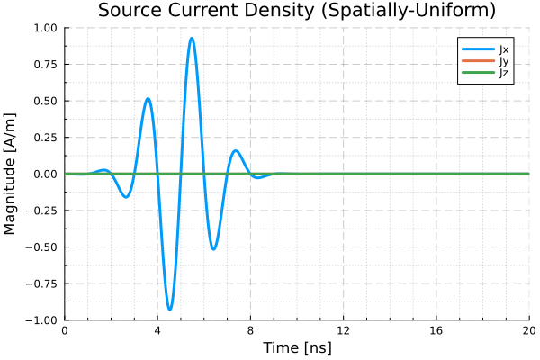

# Tutorial

## Define a propagation media

The propagation media of a model is assumed to be linear, time-invariant, and
spatially-homogeneous.

When designing a model that will propagate in vacuum (free space), a pre-defined media is
provided.
```julia
media::SimpleMedia = JefimenkoModels.CLASSICAL_VACUUM
```

Alternatively, a propagation media with Real-valued permittivity (``\varepsilon``) and
permeability (``\mu``) can be specified using `Unitful` values. Each term can be defined in
your preferred choice of units, so long as they are dimensionally-equivalent to the reference
units: ``\varepsilon`` in [F/m] or [As/Vm], and $\mu$ in [N/A``^2``] or [Vs/Am].
```julia
epsilon = 8.854_188e-15 * u"(kA*s)/(V*m)"
mu = 1.256_637e-3 * u"(mV*s)/(A*m)"
c = 2.997_925e5 * u"km/s"
SimpleMedia(epsilon, mu, c)
```

## Define a source

When any of the source components is neglected, e.g. a source with only currents (``J``) or
charges (``\rho``), a pair of pre-defined null sources are provided for convenience. The
`JefimenkoModels.NULL_CHARGE` function can be used in place of either ``\rho(\bar{r},t)``
function, and the `JefimenkoModels.NULL_CURRENT` function can be used in place of either
``J(\bar{r},t)`` function.

Source charge and current functions must be defined in a specific format. The functions
must take two arguments: a `Meshes.Point` indicating the position within the source being
evaluated, and the source time.

**Table: Line Source Functions**

| Function | Arg 1 | Arg 2 [Units] | Return Type [Units] |
|---|---|---|---|
| Electric charge density ``\rho_e(\bar{r},t)``     | `r::AbstractCoordinate` | `t::Real` [s] | `::Real` [C/m] |
| Magnetic charge density ``\rho_h(\bar{r},t)``     | `r::AbstractCoordinate` | `t::Real` [s] | `::Real` [Wb/m] |
| Electric current density ``\bar{J_e}(\bar{r},t)`` | `r::AbstractCoordinate` | `t::Real` [s] | `::SVector{3,Real}` [A] |
| Magnetic current density ``\bar{J_h}(\bar{r},t)`` | `r::AbstractCoordinate` | `t::Real` [s] | `::SVector{3,Real}` [V] |

**Table: Surface Source Functions**

| Function | Arg 1 | Arg 2 [Units] | Return Type [Units] |
|---|---|---|---|
| Electric charge density ``\rho_e(\bar{r},t)``     | `r::AbstractCoordinate` | `t::Real` [s] | `::Real` [C/m``^2``] |
| Magnetic charge density ``\rho_h(\bar{r},t)``     | `r::AbstractCoordinate` | `t::Real` [s] | `::Real` [Wb/m``^2``] |
| Electric current density ``\bar{J_e}(\bar{r},t)`` | `r::AbstractCoordinate` | `t::Real` [s] | `::SVector{3,Real}` [A/m] |
| Magnetic current density ``\bar{J_h}(\bar{r},t)`` | `r::AbstractCoordinate` | `t::Real` [s] | `::SVector{3,Real}` [V/m] |

**Table: Volume Source Functions**

| Function | Arg 1 | Arg 2 [Units] | Return Type [Units] |
|---|---|---|---|
| Electric charge density ``\rho_e(\bar{r},t)``     | `r::AbstractCoordinate` | `t::Real` [s] | `::Real` [C/m``^3``] |
| Magnetic charge density ``\rho_h(\bar{r},t)``     | `r::AbstractCoordinate` | `t::Real` [s] | `::Real` [Wb/m``^3``] |
| Electric current density ``\bar{J_e}(\bar{r},t)`` | `r::AbstractCoordinate` | `t::Real` [s] | `::SVector{3,Real}` [A``^2``] |
| Magnetic current density ``\bar{J_h}(\bar{r},t)`` | `r::AbstractCoordinate` | `t::Real` [s] | `::SVector{3,Real}` [V``^2``] |

## Construct a model

`JefimenkoModel`s have a `metadata::Dict` provision. This dictionary is not currently used
by the solver. Rather, it provides the user with a convenient place to store any desired
metadata.

The following example produces a `JefimenkoModel` with a single one-meter line source on
the x-axis. This source is characterized by a spatially-uniform continuous wave (CW) electric
current.
```julia
using JefimenkoModels
using Meshes
using Unitful
using Unitful.DefaultSymbols: m, s, A

model_line = let
    # Single line source on x-axis from -0.5m to +0.5m
    a = Meshes.Point(-0.5m, 0.0m, 0.0m)
    b = Meshes.Point( 0.5m, 0.0m, 0.0m)
    segment = Meshes.Segment(a, b)

    # Electric current only: spatially-uniform, x-directed, driven at 100 MHz
    x̂ = [1, 0, 0]
    f = 100e6 / s
    Je(r̄, t) = cos(2π * ω * t) .* x̂ .* A
    source = RadiationSource(segment, NULL_CHARGE, NULL_CHARGE, Je, NULL_CURRENT)

    # Store some metadata in the model
    metadata = Dict(:name => "Tutorial Example",
                    :charges => "None",
                    :currents => "Electric-Only"
                    :spatial_distribution => "Uniform",
                    :source_length => 1.0m,
                    :signal_type => "100 MHz CW")

    JefimenkoModel(CLASSICAL_VACUUM, [source], metadata)
end
```

The following example produces a `JefimenkoModel` for a one-meter diameter aperture source on
the xy-plane and centered on the origin. This source is characterized by a spatially-uniform
electric current and driven by a wideband transient pulse.
```julia
using JefimenkoModels
using Unitful, UnitfulCoordinateSystems

model_disk = let
    # Surface disk source with radius 0.5m
    # Electric current only: spatially-uniform, x-directed, driven by a transient pulse
    ρ₀ = 0.5m
    (t₀_s, f₀_Hz, β₀) = (5.0e-9, 500e6, 1.25)
    sig(t_s::Real) = sin(2π*f₀_Hz*t_s) * exp(-β₀*(f₀_Hz*t_s)^2)
    Je(r̄::AbstractCoordinate, t_s::Real) = x̂ .* sig(t_s-t₀_s)             # t in s -> Jₑ in A
    source = SurfaceSource_Disk{Float64}(ρ₀, NULL_CHARGE, NULL_CHARGE, Je, NULL_CURRENT)

    metadata = Dict(:description=>"Uniform current over a 0.5m disk, stimulated by transient pulse signal.")
    
    JefimenkoModel{Float64}(CLASSICAL_VACUUM, [source], metadata)
end
```

## Calculate the electromagnetic fields

The electromagnetic near-fields produced by the aperture source described above can be
calculated by specifying an observation point and the desired time-domain.
```julia
# Observation location and time domain of interest
r = CoordinateCartesian(0.0m, 0.0m, 1.5m)
t = range(0.0ns, 20.0ns, length=800)

# Calculate the fields at r over the time domain
efield = map(t -> E(r, t, model_disk), t)
hfield = map(t -> H(r, t, model_disk), t)
```

Inspecting the data on this specified time-domain, the source electric current density
(spatially-uniform across the 1 meter diameter aperture) is



The electric field measured at the observation point is


And the magnetic field measured at the observation point is


